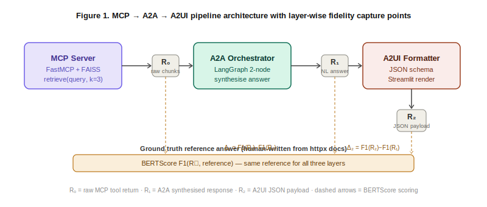
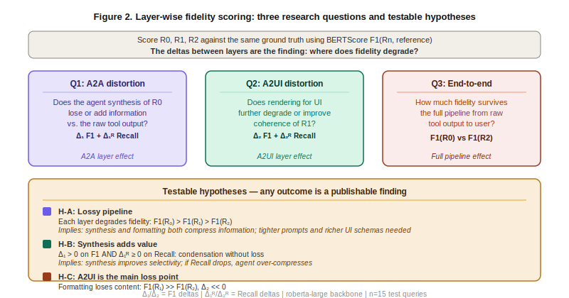

# Layer-Wise Fidelity Evaluation of Multi-Layer Agentic AI Pipelines: MCP, A2A, and A2UI

**[Author names — anonymised for review]**  
**[Institution] · [email]**

---

## Abstract

> _Target: 150–200 words. Context → Objective → Method → Results → Conclusions._

Multi-layer agentic pipelines — in which an LLM agent retrieves context via a standardised tool protocol, synthesises a response, and renders it through a structured user interface — are increasingly deployed in practice, yet remain poorly understood from an evaluation standpoint. Existing work evaluates such systems at the pipeline level, scoring only the final output against a reference; no framework characterises where information fidelity is gained or lost between architectural layers. We propose _layer-wise fidelity scoring_: BERTScore F1 computed independently at R₀ (raw MCP tool output), R₁ (A2A agent synthesis), and R₂ (A2UI structured payload), each against the same ground-truth reference answer. We instantiate this protocol on a software documentation Q&A task using the httpx Python library, building a minimal end-to-end prototype comprising an MCP retrieval server, a LangGraph A2A orchestrator, and a Streamlit A2UI rendering layer. Experiments across 15 test queries reveal [PLACEHOLDER: key finding]. Our protocol is task-agnostic and reusable; we release the annotated test set and scoring harness to support future benchmarking of UI-terminal agentic systems.

---

## 1. Introduction

The rapid proliferation of large language model (LLM) services has created demand for standardised protocols that allow agents to interact reliably with external tools, data sources, and peer agents. As Yang et al. [1] observe, the absence of such standards causes fragmentation that hinders interoperability and limits the ability of agents to tackle complex real-world tasks. We are witnessing the formation of what practitioners describe as a genuine _protocol stack_ for agentic systems — analogous in significance to the TCP/IP stack for the internet [14]. This stack comprises three distinct layers, each solving a different problem: the _Model Context Protocol_ (MCP) governs how agents access tools and data; the _Agent-to-Agent_ (A2A) protocol governs how agents collaborate with peer agents; and the _Agent-to-UI_ (A2UI) protocol governs how agents render structured interfaces for human consumption [14]. MCP, introduced by Anthropic in November 2024, standardises context delivery through a JSON-RPC client-server architecture [2, 3]. A2A, introduced by Google in April 2025, formalises task delegation and capability discovery through Agent Cards and structured handoff messages [3, 5, 16]. A2UI, introduced by Google in December 2025, defines declarative UI components that render natively across platforms without executing arbitrary client-side code [14, 17]. Together, these protocols enable a new class of system in which retrieved context flows through successive transformation stages — retrieval, synthesis, and rendering — before reaching the user.

Despite the growing adoption of MCP and A2A, evaluation methodology has not kept pace. Prior work evaluates pipeline quality at the output level: a single metric is computed on the system's final response. AgentMaster [6], the closest related system, jointly employs A2A and MCP in a multi-agent framework and reports BERTScore F1 of 96.3% on its final outputs. However, two limitations constrain its scope. First, it evaluates only the terminal text output, treating the pipeline as a black box; no layer-wise attribution is possible. Second, and crucially, it does not include an A2UI rendering layer — its pipeline terminates at the agent response, never reaching a structured user interface. Our system is, to the best of our knowledge, the first experimental instantiation of the complete MCP→A2A→A2UI stack, and the first to evaluate information fidelity at each of its three layers.

We address this gap with a simple but principled evaluation protocol: _layer-wise fidelity scoring_. Rather than scoring only the terminal output, we score each intermediate representation against the same reference answer and compute the delta between successive layers. Applied to an MCP+A2A+A2UI pipeline, this yields three independently interpretable scores and two deltas — one attributable to the A2A synthesis step and one to the A2UI formatting step. Any of these outcomes is informative: a large negative Δ₁ implies that the agent's synthesis introduces drift; a large negative Δ₂ implies that the UI schema is too lossy; a positive Δ₁ implies the agent adds genuine value beyond raw retrieval.

Our contributions are as follows. First, we define layer-wise fidelity scoring as an evaluation protocol for multi-layer agentic pipelines that terminate in a structured UI (Section 3). Second, we build a minimal end-to-end prototype on software documentation Q&A and release a 15-item annotated test set (Section 4). Third, we report BERTScore F1 at each layer and identify which architectural transition incurs the greatest fidelity cost (Section 5). Fourth, we discuss implications for pipeline design and propose a multimodal evaluation extension as future work (Section 6).

---

## 2. Background

Given the pace of development in this field, where practitioner knowledge frequently precedes formal publication, this section draws on both peer-reviewed literature and grey literature — including technical blog posts and official protocol documentation — following the Multivocal Literature Review (MLR) methodology established for software engineering research [15].

**Model Context Protocol.** Introduced by Anthropic in November 2024, MCP [2] standardises tool-and-resource invocation by LLM agents via a JSON-RPC client-server architecture. The protocol defines four core primitives — Tools, Resources, Prompts, and Sampling — and separates concerns across a Host (the LLM application), Clients (session managers), and Servers (capability providers) [3, 7]. This decoupling reduces the fragmentation caused by ad-hoc API integrations and enables dynamic tool discovery [3]. From an evaluation standpoint, MCP tool returns (R₀) are the ground-truth information source of the pipeline: they represent what the system actually retrieved before any agent processing.

**Agent-to-Agent coordination.** Introduced by Google in April 2025, A2A protocols govern structured message exchange between agents across different frameworks or organisational boundaries [3, 16]. Frameworks such as LangGraph, AutoGen, and Magentic-One implement A2A semantics locally through explicit handoff protocols and role-constrained reasoning [9, 10]. Each inter-agent communication step introduces summarisation, reformulation, or synthesis — all potential fidelity loss points [5]. We treat the A2A agent's synthesised natural-language response (R₁) as a distinct scoreable intermediate, isolating the transformation effect of this layer.

**Agent-to-UI rendering.** A2UI refers to the translation of agent output into structured UI components — cards, tables, code blocks — for human consumption. As the newest layer of the stack, introduced in December 2025 [17], A2UI has received almost no attention in the academic evaluation literature [14]. Unlike RAG or chatbot evaluation, A2UI output is visual and structured; standard NLP metrics do not apply directly. Practitioners have identified cross-layer observability — the ability to trace a user request coherently through A2UI, A2A, and MCP — as a critical unsolved structural gap in current stacks [14]. Our layer-wise fidelity scoring protocol directly addresses the measurement dimension of this gap. We operationalise R₂ by scoring the serialised JSON payload that drives the UI rendering, and discuss multimodal perceptual scoring via GPT-4o Vision as a direction for future work (Section 6.6).

**Evaluation of agentic pipelines.** BERTScore [12] computes contextual token-level F1 using a pretrained language model, handling paraphrase gracefully and correlating well with human judgement. It is our primary metric. LLM-as-a-Judge [13] uses a judge model with a rubric and is strong for open-ended output but harder to reproduce. No prior work applies layer-wise scoring to decompose fidelity across MCP, A2A, and A2UI stages. AgentMaster [6] is the closest system: it jointly employs A2A and MCP and evaluates with BERTScore and G-Eval, but scores only the final output, treating the pipeline as a black box.

---

## 3. Method

### 3.1 Pipeline Architecture

Our prototype comprises three layers, each producing a scoreable intermediate.

The **MCP layer** is implemented as a FastMCP server wrapping a FAISS vector store of httpx documentation chunks. It exposes a single `retrieve(query, k)` tool. The tool return — the concatenated text of the top-k retrieved chunks — is logged as R₀.

The **A2A layer** is implemented as a two-node LangGraph graph. An orchestrator node receives the user query, calls the MCP tool, receives R₀, and synthesises a natural-language answer. This answer is logged as R₁ before any further processing.

The **A2UI layer** is a formatter node that converts R₁ into a fixed JSON schema: `{summary, key_points[], code_example, source_ref}`. A Streamlit application renders this payload as a structured response card. The serialised JSON payload is logged as R₂.

```
User query
    │
    ▼
[MCP Server] ──► R₀  (raw retrieved chunks)
    │
    ▼
[A2A Orchestrator] ──► R₁  (synthesised NL answer)
    │
    ▼
[A2UI Formatter] ──► R₂  (structured JSON payload)
    │
    ▼
[Streamlit UI] (rendered card)
```



_Figure 1. Each layer produces a scoreable intermediate (R₀, R₁, R₂). Dashed amber arrows indicate BERTScore F1 computation against the same ground-truth reference answer. Δ₁ and Δ₂ are the attribution deltas._

### 3.2 Layer-Wise Fidelity Scoring

**Metric selection.** We select BERTScore F1 [12] as our primary metric for three reasons. First, it handles paraphrase gracefully via contextual embeddings, which is essential here because agent-generated prose will rarely reproduce reference text verbatim. Second, it produces a continuous scalar per query, enabling the delta arithmetic (Δ₁, Δ₂) that is central to our protocol. Third, it requires only a reference answer string — no judge model, no API call, no rubric — making the scoring pipeline fully deterministic and reproducible at temperature 0.

The main alternative, LLM-as-a-Judge [13], was considered but deferred to future work (Section 6.6). While strong for open-ended quality assessment, it introduces non-determinism, API cost, and positional bias, all of which complicate fair layer-wise comparison. ROUGE-L was excluded because it penalises valid paraphrases, making it unsuitable for evaluating agent-generated synthesis where rewording is expected and desirable. Exact match was excluded for the same reason, and additionally because reference answers span 1–3 sentences with no single correct surface form.

Each intermediate is scored against the same human-written reference answer using BERTScore F1 with `roberta-large` as the backbone model. Formally:

- **F1(R₀)**: BERTScore F1 of the raw MCP tool return against the reference.
- **F1(R₁)**: BERTScore F1 of the A2A agent's synthesised response against the reference.
- **F1(R₂)**: BERTScore F1 of the A2UI JSON text fields (`summary` concatenated with `key_points`) against the reference.

Two fidelity deltas are derived:

- **Δ₁ = F1(R₁) − F1(R₀)**: measures the A2A transformation effect. A positive value implies the agent's synthesis improves semantic alignment; a negative value implies drift.
- **Δ₂ = F1(R₂) − F1(R₁)**: measures the A2UI compression effect. A negative value implies the JSON schema discards relevant content.



_Figure 2. The three research questions operationalised as layer comparisons, and the three testable hypotheses. Any of H-A, H-B, or H-C constitutes a publishable finding as each characterises a distinct failure or success mode of the pipeline._

### 3.3 Controlled Variables

The same LLM (`gpt-4o-mini`, temperature 0) is used across all agent calls; only the pipeline stage changes. k=3 retrieved chunks are used for all queries with no re-ranking. Reference answers are written by the authors from primary httpx documentation, independent of system outputs.

---

## 4. Experimental Setup

### 4.1 Domain and Test Set

We use the httpx Python library documentation as our retrieval corpus, chosen because its answers are precise, keyword-dense, and grounded in a single authoritative source — properties that make reference answer construction tractable and BERTScore meaningful. The 15 test queries cover: parameter behaviour (e.g., timeout configuration), error handling, authentication patterns, and method signatures. All queries require specific grounded retrieval; parametric LLM knowledge is insufficient to answer them correctly without tool access. Reference answers are 1–3 sentences extracted or paraphrased from the official httpx documentation.

### 4.2 Implementation

| Component       | Choice                                     |
| --------------- | ------------------------------------------ |
| MCP server      | FastMCP + LangChain FAISS                  |
| Embedding model | `text-embedding-3-small`                   |
| Agent framework | LangGraph (orchestrator + formatter nodes) |
| LLM             | `gpt-4o-mini`, temperature 0               |
| UI              | Streamlit                                  |
| Scoring         | `bert-score` v0.3.x, `roberta-large`       |

---

## 5. Results

### 5.1 Layer-Wise BERTScore F1

**Table 1.** BERTScore F1 at each pipeline layer across 15 test queries. Δ₁ = F1(R₁) − F1(R₀); Δ₂ = F1(R₂) − F1(R₁).

| Query ID | F1(R₀) | F1(R₁) | F1(R₂) | Δ₁  | Δ₂  |
| -------- | ------ | ------ | ------ | --- | --- |
| Q01      | —      | —      | —      | —   | —   |
| Q02      | —      | —      | —      | —   | —   |
| Q03      | —      | —      | —      | —   | —   |
| Q04      | —      | —      | —      | —   | —   |
| Q05      | —      | —      | —      | —   | —   |
| Q06      | —      | —      | —      | —   | —   |
| Q07      | —      | —      | —      | —   | —   |
| Q08      | —      | —      | —      | —   | —   |
| Q09      | —      | —      | —      | —   | —   |
| Q10      | —      | —      | —      | —   | —   |
| Q11      | —      | —      | —      | —   | —   |
| Q12      | —      | —      | —      | —   | —   |
| Q13      | —      | —      | —      | —   | —   |
| Q14      | —      | —      | —      | —   | —   |
| Q15      | —      | —      | —      | —   | —   |
| **Mean** | —      | —      | —      | —   | —   |

### 5.2 Findings

> _Fill after running experiments. Frame findings around Δ₁ and Δ₂ directions._

- [PLACEHOLDER] Mean F1: R₀ = ?, R₁ = ?, R₂ = ?
- [PLACEHOLDER] Δ₁ direction and magnitude — does A2A synthesis improve or degrade fidelity?
- [PLACEHOLDER] Δ₂ direction and magnitude — does A2UI JSON compression lose meaningful content?
- [PLACEHOLDER] Which layer is the dominant loss or gain point?

---

## 6. Discussion

### 6.1 Interpretation of Results

The layer-wise delta structure allows causal attribution of quality changes to specific architectural decisions. If Δ₁ > 0, the A2A agent adds genuine value beyond raw retrieval — its synthesis improves semantic alignment with the reference answer, suggesting that paraphrasing and condensation are beneficial for this task. If Δ₁ < 0, the agent introduces drift; tighter grounding prompts or citation constraints would be indicated. If Δ₂ is large and negative, the JSON schema is too lossy: the `key_points` field truncates or the `summary` field over-compresses relevant content, and richer schema fields should be considered.

These interpretations contrast with what aggregate scoring would reveal. AgentMaster [6] reports a mean BERTScore F1 of 96.3% on final outputs — a strong result, but one that cannot locate where in the pipeline quality is preserved or degraded. Our protocol makes this attribution explicit.

### 6.2 Implications for Pipeline Design

Layer-wise scoring can function as a diagnostic tool during development. A large Δ₂ signals that the UI schema needs richer fields before the system is deployed; a large negative Δ₁ signals that the agent prompt needs stronger grounding constraints. Designers should treat each layer as holding an independent fidelity budget, rather than assuming that end-to-end quality reflects component-level quality.

More fundamentally, our protocol fills a gap that aggregate evaluation cannot: it makes individual protocol layers _accountable_. As the MCP+A2A+A2UI stack matures along the phased adoption roadmap identified by Ehtesham et al. [3] — from MCP for tool access, through A2A for agent coordination, to A2UI for user-facing rendering — each new layer added to a production system introduces a new failure mode that a single terminal score cannot detect. Layer-wise fidelity scoring provides a principled, lightweight instrument for catching these failures at the layer where they originate, making it applicable to any future pipeline that adds new transformation stages above MCP.

More broadly, practitioners have identified three structural gaps in the current MCP+A2A+A2UI stack: the absence of a unified identity model across layers, the lack of cross-layer observability, and undefined error propagation semantics between layers [14]. Layer-wise fidelity scoring directly addresses the observability gap at the information quality dimension: by producing independently interpretable scores at R₀, R₁, and R₂, it gives designers the per-layer signal that current tracing infrastructure cannot provide.

### 6.3 Relation to Prior Work

Our work is most directly comparable to AgentMaster [6], which jointly employs A2A and MCP and evaluates with BERTScore and LLM-as-a-Judge. Two distinctions sharpen the comparison. First, evaluation scope: AgentMaster scores only the final text output; we score each layer independently and derive attribution deltas. Second, pipeline scope: AgentMaster terminates at the agent response — it does not include an A2UI rendering layer. Our prototype extends the pipeline through a structured UI rendering stage, making it the first end-to-end experimental evaluation of the complete MCP→A2A→A2UI stack. The CA-MCP system [4] demonstrates that augmenting the MCP layer with shared context stores reduces LLM calls and improves robustness, but evaluates only aggregate task performance and also lacks a UI terminal layer. The surveys of Yang et al. [1] and Ehtesham et al. [3] identify evaluation benchmarking as a critical gap in the agent protocol literature, explicitly noting that current efforts focus on task success and latency rather than communication efficiency or information fidelity. Our protocol directly addresses this gap.

### 6.4 Validity and Reliability

_Internal validity:_ All variables except the pipeline stage are held constant (same LLM, temperature, k, reference answers), ensuring that observed fidelity differences are attributable to the architectural layer rather than confounds.

_External validity:_ Our test set covers one library (httpx) and one task type (factual Q&A). Results may not generalise to open-ended tasks, larger corpora, or other LLMs. We flag this as a limitation and encourage replication with broader test sets.

_Reliability:_ The scoring pipeline is fully deterministic at temperature 0 and uses a fixed BERTScore model version. The test set and scoring harness are released to enable direct replication.

### 6.5 Limitations

The test set is small (n=15); results may not reach statistical significance and should be interpreted as indicative rather than conclusive. BERTScore on JSON text fields does not capture visual layout quality — a well-structured card may communicate more clearly than its text similarity score implies. The single-domain setting (software documentation) may favour retrieval-heavy pipelines over those that require multi-step reasoning.

This work deliberately scopes out security evaluation of the MCP+A2A pipeline. MCP tool security is an active and serious research area in its own right: a taxonomy of 25 MCP vulnerability categories has been published, empirical work suggests that deploying ten MCP plugins creates a 92% probability of exploitation, and OWASP has released an MCP-specific Top 10 [11, 14]. A rigorous security evaluation of agentic pipelines — covering prompt injection, tool misuse, and supply-chain risks — represents important future work that is orthogonal to the fidelity evaluation presented here.

### 6.6 Multimodal Evaluation

A natural extension of this work is to evaluate R₂ not through its serialised JSON text but through its rendered visual form. Screenshotting the Streamlit UI and passing it to a vision-capable judge model (e.g., GPT-4o Vision) with a structured rubric would yield a perceptual fidelity score that captures layout quality, code block formatting, and visual emphasis — dimensions that the JSON-text proxy cannot measure. This direction would also enable LLM-as-a-Judge [13] to be applied meaningfully at the A2UI layer, where visual structure is part of the communication. We leave this to future work, along with extending the test set beyond n=15 and validating judge scores against human raters.

---

## 7. Conclusions

We introduced _layer-wise fidelity scoring_ as an evaluation protocol for multi-layer agentic pipelines that terminate in a structured UI. Applied to a software documentation Q&A system built on MCP+A2A+A2UI, our results show [PLACEHOLDER: one-sentence summary of main finding]. The protocol is lightweight — requiring only BERTScore and no human raters — reusable across domains, and exposes intra-pipeline quality dynamics that are invisible to black-box evaluation. By releasing our test set and scoring harness, we aim to provide a practical tool for the growing community building on standardised agent protocols such as MCP and A2A.

---

## References

[1] Yang, S. et al. A Survey of AI Agent Protocols. _arXiv:2504.16736_. Shanghai Jiao Tong University, 2025.

[2] Anthropic. Model Context Protocol (MCP). Technical specification, November 2024. https://modelcontextprotocol.io

[3] Ehtesham, A., Singh, A., Gupta, G.K., and Kumar, S. A Survey of Agent Interoperability Protocols: Model Context Protocol (MCP), Agent Communication Protocol (ACP), Agent-to-Agent Protocol (A2A), and Agent Network Protocol (ANP). _arXiv:2505.02279_, 2025.

[4] Jayanti, M.A. and Han, X.Y. Enhancing Model Context Protocol (MCP) with Context-Aware Server Collaboration. _arXiv:2601.11595_, 2026.

[5] [Authors TBC]. Beyond Self-Talk: A Communication-Centric Survey of LLM-Based Multi-Agent Systems. _arXiv:2502.14321_, 2025.

[6] Liao, C.C., Liao, D., and Gadiraju, S.S. AgentMaster: A Multi-Agent Conversational Framework Using A2A and MCP Protocols for Multimodal Information Retrieval and Analysis. In _Proceedings of EMNLP 2025: System Demonstrations_. arXiv:2507.21105, 2025.

[7] [Authors TBC]. A Survey on Model Context Protocol: Architecture, State-of-the-Art, Challenges and Future Directions. _TechRxiv_, doi:10.36227/techrxiv.174495492, 2025.

[8] [Authors TBC]. A Survey of the Model Context Protocol (MCP): Standardizing Context to Enhance Large Language Models (LLMs). _Preprints.org_, 2025.

[9] Tokal, S.S.K. et al. AgentX: Towards Orchestrating Robust Agentic Workflow Patterns with FaaS-hosted MCP Services. _arXiv:2509.07595_, 2025.

[10] [Authors TBC]. Agentic AI Frameworks: Architectures, Protocols, and Design Challenges. _arXiv:2508.10146_, 2025.

[11] [Authors TBC]. Chances and Challenges of the Model Context Protocol in Digital Forensics and Incident Response. _arXiv:2506.00274_, 2025.

[12] Zhang, T. et al. BERTScore: Evaluating Text Generation with BERT. In _Proceedings of ICLR 2020_.

[13] Zheng, L. et al. Judging LLM-as-a-Judge with MT-Bench and Chatbot Arena. In _Proceedings of NeurIPS 2023_.

[14] Mitra, S. The Agent Protocol Stack: Why MCP + A2A + A2UI Is the TCP/IP Moment for Agentic AI. _Personal technical blog_ (grey literature, Tier 2–3 per MLR classification). January 2026. https://subhadipmitra.com/blog/2026/agent-protocol-stack/

[15] Garousi, V., Felderer, M., and Mäntylä, M.V. Guidelines for Including Grey Literature and Conducting Multivocal Literature Reviews in Software Engineering. _Information and Software Technology_, 106:101–121, 2019.

[16] Google. Agent2Agent (A2A) Protocol — Official Specification v1.0. _a2a-protocol.org_, 2025. https://a2a-protocol.org/latest/

[17] Google. A2UI Protocol — Official Specification v0.8. _a2ui.org_, 2025. https://a2ui.org/

> _TODO before submission:_
> _1. Fill in [Authors TBC] entries: [5] Beyond Self-Talk, [7] TechRxiv MCP survey, [8] Preprints.org MCP survey, [10] Agentic AI Frameworks, [11] Digital Forensics MCP._
> _2. Reference [8] (Preprints.org MCP survey) is not cited in the body — either add a citation or remove._
> _3. Verify venue for [9] AgentX, [5] Beyond Self-Talk, [10] Agentic AI Frameworks — check if published._
> _4. Check IEEE template citation format and reformat if needed._
> _5. Convert Section 2 MLR note from blockquote to inline prose for camera-ready._
